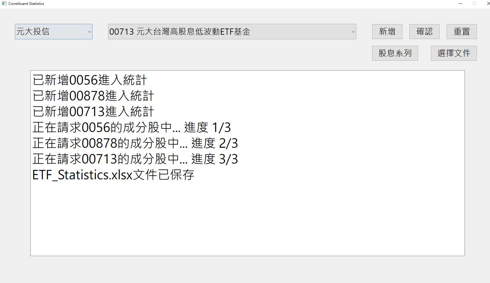
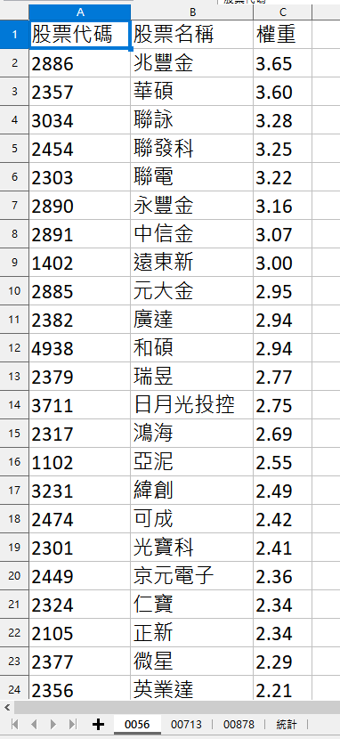
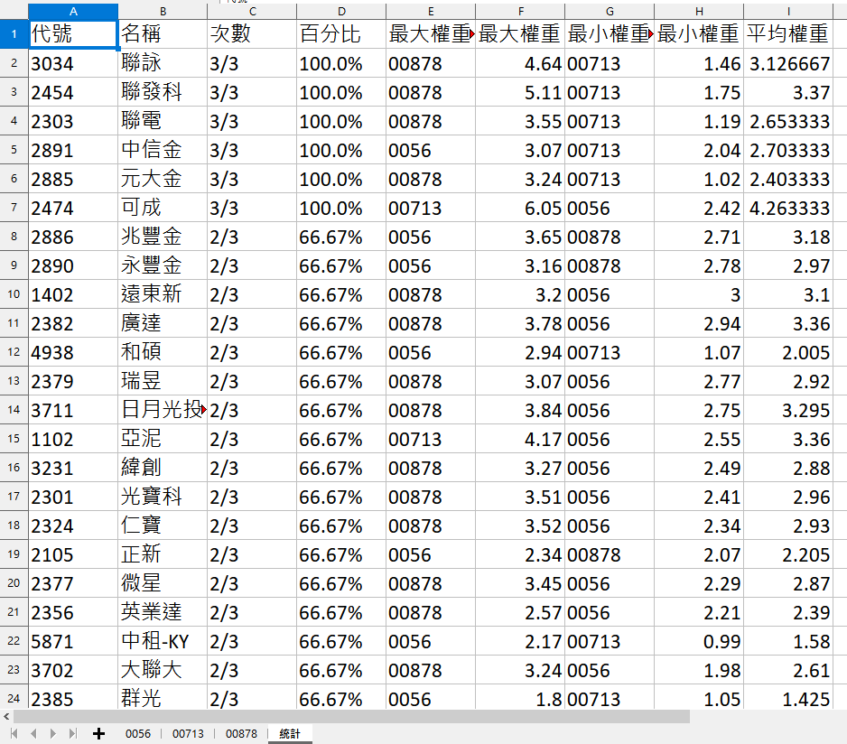

# Taiwan-ETF-Constituent-Statistics
## 這是什麼專案?
這是一個用來統計台灣各家投信所出的國內股票型ETF中成分股的出現次數的專案    
例如現在流行高股息ETF，想知道哪些個股是被多個ETF給納入，就可以使用。  
此專案僅為個人研究用途  

## robots.txt
https://www.moneydj.com/robots.txt

## 需要安裝哪些套件
參考 requirements.txt  

## 更新紀錄  
1.處理request異常  
2.將各個etf的csv檔案合併成xlsx  
3.新增股息系列功能  
4.請求時，鎖定按鈕  
5.新增新的etf  
6.將開發金更名成凱基金  
7.輸出檔案記錄新增每個etf的內容及增加平均權重  
8.選取一個寫有etf的txt檔案後請求資料(參考etf_list.txt)  

## 還能怎麼擴充?
1.如股息系列，新增其他主題類型

## 有哪些物件
### 目前專案撰寫了6個物件
1.MainWindow GUI  
2.WorkerThread QThread  
3.ETFLoader 讀取etf_issuer資料夾內的csv資料  
4.StockLoader 讀取stock資料夾內的csv資料  
5.ETFRequester 請求各個ETF的成分股資料  

## 之後新出的ETF或新投信沒有怎麼辦?
需要手動將資料添加到etfs.xlsx裡  

# 展示
## 以流行的月月配組合 0056+00878+00713示範

<iframe width="560" height="315" src="https://github.com/yosanyu/Taiwan-ETF-Constituent-Statistics/blob/master/openfile.mp4" frameborder="0" allowfullscreen></iframe>
